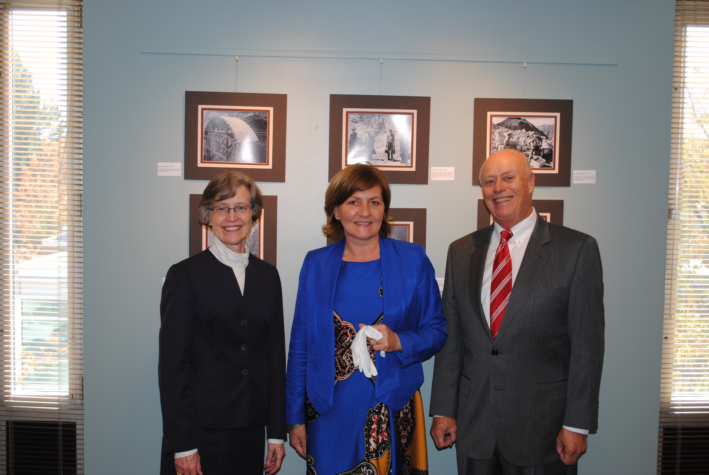
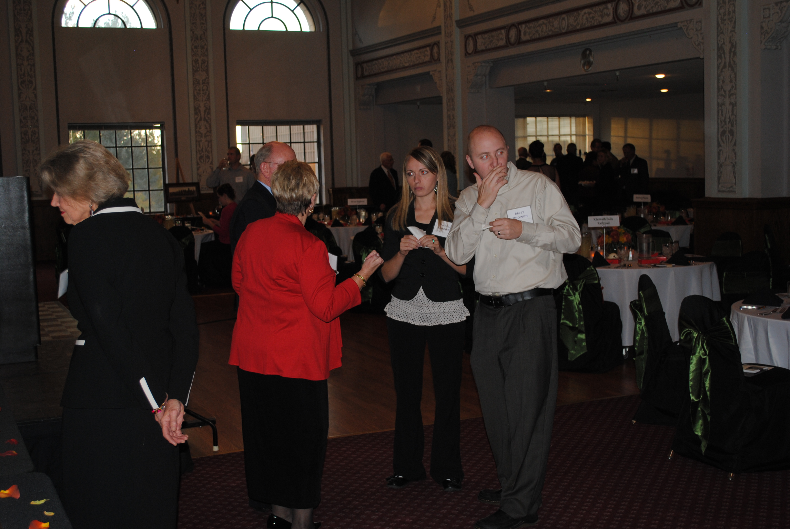
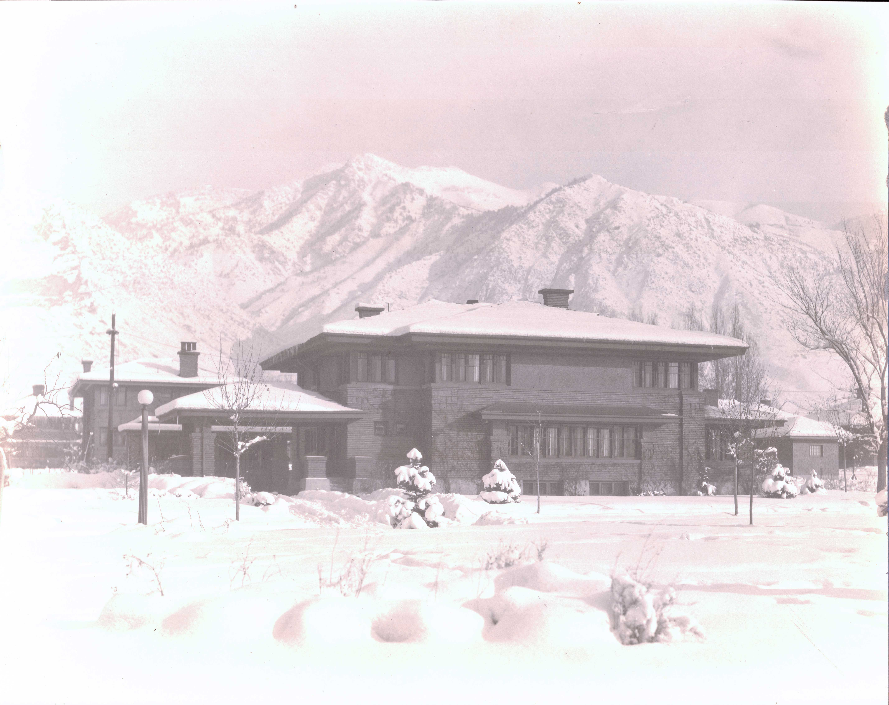

<section id="banner" class="style2">
  

  
  
  
    <header class="major">
    </header>
  

<h2>{{ page.description }}</h2>

<!--end content div -->

<!--end inner div -->
</section>

  <section id="one">
  

  <header class="major">
  </header>

The history of the Utah Construction Company and its successors is an American success story that stretches from its simple beginnings laying rail lines across the West to its role in creating some of the most monumental structures of the 20th century. From its founding in Ogden, Utah, in 1900 until 1976 when Utah International and General Electric negotiated the largest corporate merger in the United States to that time, Utah Construction transformed lives worldwide through the vision of its founders.

In October 1999, the Utah Construction/Utah International Collection was donated to Weber State University’s Stewart Library by Edmund Wattis Littlefield, former company president and chairman of the board, and by Broken Hill Proprietary, Ltd. The company archives contained more than 300 boxes of minutes, financial records, correspondence, scrapbooks, and project reports and more than half a million photographs. A gift from the William H. &amp; Mattie Wattis Harris Foundation assisted in processing and preserving this extensive collection and in underwriting its public unveiling in 2001.

  <ul class="actions small">
    <li><a href="#symp_time" class="button">Symposium Timeline</a></li>
    <li id="symp_time"><a href="#white" class="button">White Glove Event</a></li>
    <li><a href="#three" class="button">Fundraising Dinner</a></li>
    <li><a href="#wattis" class="button">Wattis Home Tour</a></li>
  </ul>

<header class="major">
<h3>Utah Construction - Utah International Symposium Timeline</h3>
</header>

<ul>
<li><h4><a href="symposia_pages/2001.html">UCC Founders Utah Construction/Utah International Symposium 2001</a></h4>

The collection was unveiled to the public, WSU community, and founders’ family members in fall 2001. The Stewart Library published Preserving the Memories, with short biographical sketches of the company’s founders and a collection of historic photographs that gave an overview of Utah Construction’s accomplishments. The university produced a video that included interviews from representatives of each founder’s family. The library also presented an exhibit of photographs from the company’s projects worldwide. Robert Gottlieb, Henry R. Luce Professor of Urban and Environmental Policy at Occidental College, gave a public presentation, “Why Place Matters: Lessons for a Changing West.”
</li>

<li><h4><a href="symposia_pages/2002.html">Geiger Utah Construction/Utah International Symposium 2002</a></h4>

The second annual symposium featured Utah International: A Biography of a Business by Gene A. Sessions and Sterling D. Sessions, a commemorative edition of the company’s history published by Weber State and the Stewart Library. The symposium also featured a conversation with the authors; a lecture by Dr. Thomas G. Alexander, the Lemuel H. Redd, Jr. Professor of American Western History at Brigham Young University; and a photographic exhibit on “Mining in the West” which included artifacts, photographs, and memorabilia.
</li>

<li><h4><a href="symposia_pages/2003.html">Hoover damn Utah Construction/Utah International Symposium 2003</a></h4>

“Water and Power in the American West” was the theme for the third annual symposium, which had as its centerpiece a photographicexhibit and a publication on the construction of the Hoover Dam. Inside the Hoover Dam Scrapbooks was based on the photographic scrapbooks presented to Six Companies officials following the dedication of the Hoover Dam. A lecture and panel discussion featuredhistory scholars and an exchange of ideas on the Bureau of Reclamation and water rights in dam construction projects. Additional images and charts from the McNamara family rounded out the exhibit.
</li>

<li><h4><a href="symposia_pages/2004.html">Utah Construction/Utah International Symposium 2004</a></h4>

Making Tracks: Railroading 1900-1930 focused on the company’s role in the dramatic expansion of the West through the construction of the railway system. It included a panel discussion and a lecture on photography along the Western railroads. A photographic exhibit and a publication featured the Feather River line; the Tepic to La Quemada; and the grand opening of the line between Klamath Falls, Oregon, and Alturas, California.
</li>

<li><h4><a href="symposia_pages/2005.html">Utah Construction/Utah International Symposium 2005</a></h4>

Building America’s Defense: 1939-1975” was the theme of the 2005 symposium. A photographic exhibit and a publication featured a variety of military projects ranging from the building of the Alaska Highway to the construction of NORAD. Speakers included historians Douglas Brinkley and Robert Berlin, WSU professors of History Bill Allison, Susan Matt, Gene Sessions, and former company geologist Charles D. Snow.
</li>

<li><h4><a href="symposia_pages/2006.html">Utah Construction/Utah International Symposium 2006</a></h4>

The sixth annual symposium will explore the combined leadership of Marriner S. Eccles and Edmund W. Littlefield, who each served as company president and chair of the board of directors. Although the two men contrasted in personality and management style, their talents and interaction developed Utah International as a successful mining multi-national and poised it for the 1976 merger with General Electric.
</li>

<li><h4><a href="symposia_pages/2007.html">Founder_David Eccles  Utah Construction/Utah International Symposium 2007</a></h4>

The 2007 Symposium explores the emergence of the Utah Construction Company and the lives and careers of its entrepreneurial founders - Thomas D. Dee, David Eccles, Edmund O., William H. and Warren L. Wattis.
The university has only begun to develop the potential of the collection. The company’s history of achievement represents a wealth of experience in the areas of project management, strategic planning, decision-making and corporate leadership.
</li>

<li><h4><a href="symposia_pages/2012.html">Utah Construction/Utah International Symposium 2012</a></h4>

Come celebrate the legacy of Utah Construction/Utah International
October 20, 2012
. Starting at 2:00 p.m. at Weber State University Stewart Library. For more information view the White Glove Event page
A fundraising dinner to aid in the processing of the collection will be held that evening at 6:00 p.m. at the historic Ben Lomond Hotel. For more information view the Fundraising Dinner page
Tours of the historic E.O. Wattis home will be available October 19-21.

For more information on <a href="#wattis">The Wattis Home Tour</a>, <a href="#white">The White Glove Event</a> & <a href="#three">The Fundraising Dinner</a> view the sections below.
</li>
</ul>

<a href="#banner"><em>Back to the top</em></a>

</section>

<section id="two" class="spotlights">
<section>
<em></em>

<header class="major">

<h4>White Glove Event</h4>

</header>

On Saturday, October 20, 2012, guests gathered at WSU’s Stewart Library Special Collections for a special “white glove” event. University President, Ann Millner, began the event by welcoming everyone and expressing her appreciation for the support given to process the Utah Construction Company Collection. After further remarks by Marta Wojcicki, BHP Billiton Records Governance Specialist, and Dan McNamara, great-grandson of W.H. Wattis, and former UCC employee, guests were able to view two new exhibits and tour the storage facility for the new additions.

</section>
<!--   <em></em>
 -->  <section>
  <em></em>
  

  <em></em>
  
<header class="major">

</header>

That evening the Stewart Library also hosted a fundraising dinner, underwritten by Denise Sobel, at the historic Ben Lomond Hotel. Framed reproductions of Utah Construction Company photos were available in our silent auction, and a special video presentation was shown highlighting the legacy of the Utah Construction Company. Copies of the video were given that night as a keepsake, in addition to copies of Dee, Eccles, and Wattis family correspondence.

</section>

<section><em>
  
</em>

  
<header class="major">

</header>

Throughout the weekend, Denise Sobel graciously opened the E.O. Wattis home for tours. Students from WSU’s Interior Design program hosted the tours and shared with visitors information about the restoration of the home and its grounds. Descendants of UCC founders and community members alike enjoyed these tours.

<a href="/symposia_pages/white_program.html"><em>White Glove Program</em></a>

<a href="#banner"><em>Back to the top</em></a>

</section>

<!--

Creating new section

-->

<em>

</em>
</section>
  <em>
  

</em>

<section id="three">
  <em></em>
  
<header class="major">

<h4>Fundraising Dinner 2012</h4>

</header><em>

<section>
<h5><strong>Fundraising Dinner Program</strong></h5>

<address>Location: Historic Ben Lomond Hotel, Crystal Ballroom 
Time: 6 – 9 p.m.</address>   

RSVP by October 4 to 801-626-7628 
cprice@weber.edu 
online payment: alumni.weber.edu/whiteglove

Silent Auction of photographic replicas from the collection will be open through dinner.

<h5><a href="#">Items for Auction</a></h5>

<h5>Brief Program:</h5>

<ul>
  <li>“Discover the UC/UI Legacy” video</li>
  <li>Denise Sobel, Littlefield Foundation</li>
  <li>Winners announced of the silent auction items and close evening</li>
</ul>

<h5 style="text-decoration:underline;"><strong>MENU</strong></h5>

<h5><em>Cocktails</em></h5>

<ul>
  <li>The Dambreaker featuring Ogden’s Own Five Wives Vodka</li>
  <li>Rooster’s Microbrew Beer</li>
  <li>Wines</li>
</ul>

<h5><em>Along the Feather River appetizers:</em></h5>

<ul>
  <li>Fresh bruschetta crostini</li>
  <li>Whipped, smoked Utah red trout mousse with Utah Sheppard's goats cheese crostini</li>
  <li>Mini stuffed mushroom caps with melted Beehive cheese</li>
  <li>Cheese and fruit tray featuring local fruit and cheese with infused miller honey</li>
  <li>Grilled veggie skewers</li>
  <li>Mount Goldsworthy Soup and Cairn Curran Salad course</li>
</ul>

A combo plate featuring a fall harvest squash soup and a mini maple blarney salad with blue cheese crumbles, candied walnuts, apples and cranberries.
 U-3 Ranch Braised Beef <strong>(Entrée)</strong>

Braised beef roast in a medley of fresh herbs and Cherny Bock reduction; accompanied with root vegetables and tri-colored roasted potatoes

<h5>Weber Club Cobbler</h5>

A fruit cobbler topped with a house made "Ogden's Own' Underground cream

<a href="#banner"><em>Back to the top</em></a>

</section>

</em>

</section>

<!-- 

Wattis Home Tour

-->

<section class="spotlights">
<section id="five">
<em></em>

<header class="major">

<h4>E.O. Wattis Home Tour 2012</h4>

</header>

<em>

Come explore the historic home of Utah Construction Company founder Edmund O. Wattis.

The tours will be:

<ul>
  <li>Friday, October 19, 2012 from 3:00-5:00 p.m.</li>
  <li>Saturday, October 20, 2012 from 10:00 a.m.-12:00 p.m.</li>
  <li>Sunday, October 21, 2012 from 10:00 a.m.-12:00 p.m.</li>
</ul>

All tours will be conducted by Interior Design students from Weber State University.

To RSVP for the tours contact Carla Price at 801-626-7628

</em>

<a href="#banner"><em>Back to the top</em></a>

</section>
</section>

  

